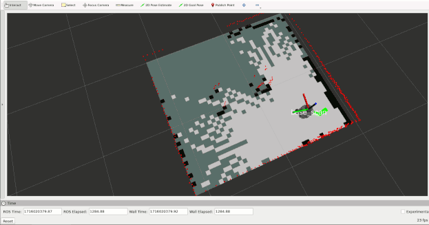
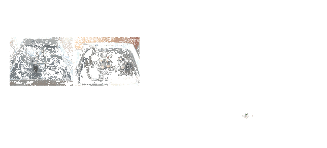
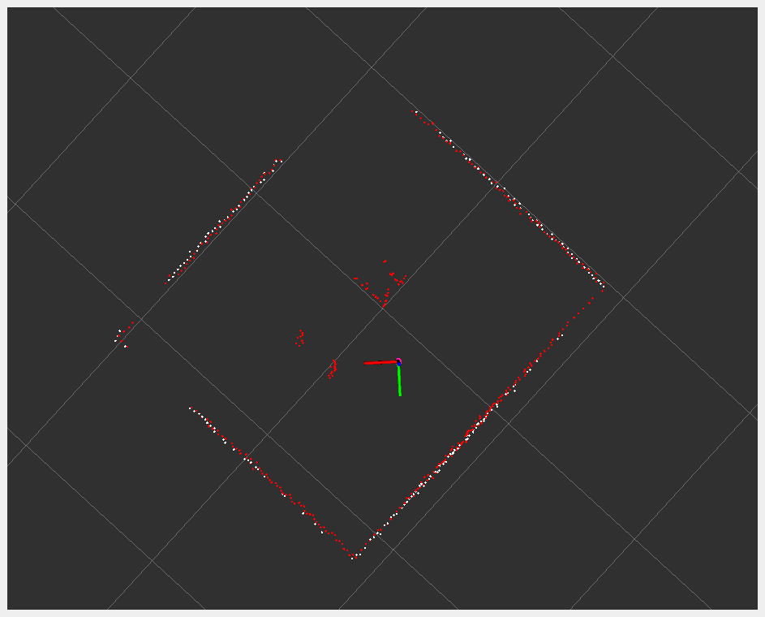

## Project description

Robot can be “dropped” in any place in a rectangular room. Based on laser readings, it tries to detects the walls and corners of the room. It chooses one corner (possibly the closest, but sometimes it chooses
another one) and it goes to there. Then it chooses the next closest corner in counter clockwise direction and goes there. Then it repeats the process. I named it “patrol”.

### Simulation


### Real robot


### LIDAR - Real robot vs Simulation

LIDAR sensors are very different in the simulation and on the real robot.
In the simulation, ranges has 360 slots and the ranges[0] is in front of the robot, and agles are all positive (from 0 radian to 2*PI radian).

On the real robot, ranges has 720 slots and ranges[360] is in front of the robot, and angles are from (nearly) -PI to PI.
I had a hard time to creating algorithms which work well in both environment.

What I did is a wrapper for LaserScan. It is always “shows” itself as the LaserScan in simulator.
So you do not need to write different codes for simulator and real robot.

Here is:
angle_utils.py

```py
from math import pi
from typing import List
from sensor_msgs.msg import LaserScan

two_pi = 2 * pi

def index_from_rad(rad: float, angle_min: float, angle_max: float, angle_increment: float):
    assert rad >= -two_pi and rad <= two_pi, "Invalid radian"

    angle = rad - angle_min

    if angle < 0:
        angle += two_pi
    if angle > two_pi:
        angle -= two_pi

    index = round(angle / angle_increment)

    ranges = round((angle_max - angle_min)/angle_increment) + 1
    return min(max(0, index), ranges - 1)

def index_from_grad(grad: int, rad_angle_min: float, rad_angle_max: float, rad_angle_increment: float):
    rad = grad * two_pi / 360.0
    return index_from_rad(rad, rad_angle_min, rad_angle_max, rad_angle_increment)

class UnifiedLaserScan():
    def __init__(self, msg: LaserScan):
        self._msg = msg
        self.header = msg.header
        self.angle_min = 0
        self.angle_max = two_pi
        self.angle_increment = two_pi/360.0
        self.time_increment = msg.time_increment
        self.scan_time = msg.scan_time
        self.range_min = msg.range_min
        self.range_max = msg.range_max
        self.ranges = msg.ranges if len(msg.ranges) == 360 else self._get_ranges()
        # TODO: intensities are not transformed
        self.intensities = msg.intensities

    def _get_ranges(self) -> List[float]:
        return [
            self._msg.ranges[
                index_from_grad(i,
                    self._msg.angle_min, self._msg.angle_max,
                    self._msg.angle_increment)
            ]
            for i in range(360)
        ]

```

A test file to see how it works:
test_angle_utils.py

```py

from path_planner_server.angle_utils import UnifiedLaserScan, index_from_grad, index_from_rad
from math import pi
import pytest
from sensor_msgs.msg import LaserScan
from std_msgs.msg import Header

def index_from_rad_simu(rad: float) -> int:
    return index_from_rad(rad, 0.0, 6.28000020980835, 0.01749303564429283)

def index_from_rad_real_robot(rad: float) -> int:
    return index_from_rad(rad, -3.1241390705108643, 3.1415927410125732, 0.008714509196579456)

def index_from_grad_simu(grad: int) -> int:
    return index_from_grad(grad, 0.0, 6.28000020980835, 0.01749303564429283)

def index_from_grad_real_robot(grad: int) -> int:
    return index_from_grad(grad, -3.1241390705108643, 3.1415927410125732, 0.008714509196579456)


def test_index_from_rad_simu():
    assert index_from_rad_simu(0) == 0
    assert index_from_rad_simu(pi/2) == 90
    assert index_from_rad_simu(pi) == 180
    assert index_from_rad_simu(3 * pi/2) == 269
    assert index_from_rad_simu(-pi/2) == 269

def test_index_from_rad_real_robot():
    assert index_from_rad_real_robot(0) == 358
    assert index_from_rad_real_robot(pi/2) == 539
    assert index_from_rad_real_robot(pi) == 719
    assert index_from_rad_real_robot(3 * pi/2) == 178
    assert index_from_rad_real_robot(-pi/2) == 178

def test_index_from_rad_out_of_range():
    assert index_from_rad_simu(-2 * pi) == 0
    with pytest.raises(AssertionError):
        index_from_rad_simu(2 * pi + 0.01)
    with pytest.raises(AssertionError):
        index_from_rad_simu(-2 * pi - 0.01)

def test_index_from_grad_simu():
    assert index_from_grad_simu(0) == 0
    assert index_from_grad_simu(90) == 90
    assert index_from_grad_simu(180) == 180
    assert index_from_grad_simu(270) == 269
    assert index_from_grad_simu(-90) == 269

def test_index_from_grad_real_robot():
    assert index_from_grad_real_robot(0) == 358
    assert index_from_grad_real_robot(90) == 539
    assert index_from_grad_real_robot(180) == 719
    assert index_from_grad_real_robot(270) == 178
    assert index_from_grad_real_robot(-90) == 178

def test_index_from_grad_out_of_range():
    assert index_from_grad_simu(-360) == 0
    with pytest.raises(AssertionError):
        index_from_grad_simu(361)
    with pytest.raises(AssertionError):
        index_from_grad_simu(-361)

def test_unified_laserscan_init_simu():
    scan = LaserScan(angle_min=0.0, angle_max=2*pi, angle_increment=2*pi/360.0)
    scan.ranges = [float(i) for i in range(360)]

    uscan = UnifiedLaserScan(scan)

    assert uscan.ranges[100] == 100.0

def test_unified_laserscan_init_robot():
    scan = LaserScan(angle_min=-3.1241390705108643, angle_max=3.1415927410125732, angle_increment=0.008714509196579456)
    scan.ranges = [float(i) for i in range(720)]

    uscan = UnifiedLaserScan(scan)

    assert uscan.ranges[-180] == 719
    assert uscan.ranges[-90] == 178
    assert uscan.ranges[0] == 358
    assert uscan.ranges[90] == 539
    assert uscan.ranges[180] == 719
    assert uscan.ranges[270] == 178
    assert uscan.ranges[359] == 356
```

How to use this:

```py
def laser_callback(self, _msg: LaserScan):
        msg = UnifiedLaserScan(_msg)
        ranges = msg.ranges

        self.get_logger().debug('indexes: front: %d, left: %d, back: %d, rigth: %d' % (0, 90, 180, 270))
        self.get_logger().debug('ranges: front: %.2f, left: %.2f, back: %.2f, rigth: %0.2f' % 
                               (ranges[0], ranges[90], ranges[180], ranges[270]))
        self.get_logger().debug('ranges size:%d' % (len(ranges)))
        with self.q.mutex:
            self.q.queue.clear()

        self.q.put(msg)
```

### Wall finder algorithm

**I assumed, that the robot is in a rectangle room.**

So the algorithm finds the smallest outer rectangle based on laser scanned distances.
It was easy if I assumed, that the robot is parallel with the walls:

```py
ranges: List[float] = np.copy(msg.ranges)
angles: List[float] = [i * msg.angle_increment for i,r in enumerate(ranges)]

heights: List[float] = [r * math.cos(angles[i]) for i,r in enumerate(ranges)]
widths:  List[float] = [r * math.sin(angles[i]) for i,r in enumerate(ranges)]

# rectangle height upward from the robot
h_plus = max(heights)
# rectangle height downward from the robot, this is negative
h_minus = min(heights)
# rectangle width on the right side of the robot
w_plus = max(widths)
# rectangle width on the left side of the robot, this is negative
w_minus = min(widths)

rectangle_area = (h_plus - h_minus) * (w_plus - w_minus)
```

In the next version, I tried to rotate the coordinate of the rectangle in the range of 0-90 degrees.
If the rectangle has the minimum area, then this is the rotation of the robot compared to the room:

```py
ranges: List[float] = np.copy(msg.ranges)

for beta in range(90):
    angles: List[float] = [(i + beta) * msg.angle_increment for i,r in enumerate(ranges)]

    heights: List[float] = [r * math.cos(angles[i]) for i,r in enumerate(ranges)]
    widths:  List[float] = [r * math.sin(angles[i]) for i,r in enumerate(ranges)]

    # rectangle height upward from the robot
    h_plus = max(heights)
    # rectangle height downward from the robot, this is negative
    h_minus = min(heights)
    # rectangle width on the right side of the robot
    w_plus = max(widths)
    # rectangle width on the left side of the robot, this is negative
    w_minus = min(widths)

    rectangle_area = (h_plus - h_minus) * (w_plus - w_minus)
    # if rectangle_area is less than for the rectangles for previous betas, store it as
    # the minimum
```
I put the coordinates of the wall into a topic:

```py
def sendWall(self, msg: LaserScan, h_plus, h_minus, w_plus, w_minus, heights, widths):
        wall = copy.deepcopy(msg)
        for i,v in enumerate(wall.ranges):
            wall.ranges[i]=0.0

        for i,r in enumerate(msg.ranges):
            if self.eq(heights[i], h_plus, h_minus) or self.eq(widths[i], w_plus, w_minus):
                wall.ranges[i] = msg.ranges[i]

        self.publisher.publish(wall)

    def eq(self, v, v_plus, v_minus):
        return abs(v - v_plus) < 0.03 or abs(v - v_minus) < 0.03
```

Here the red dots are the laser scan ranges and the white dots are the laser scanned ranges considered to be walls:

